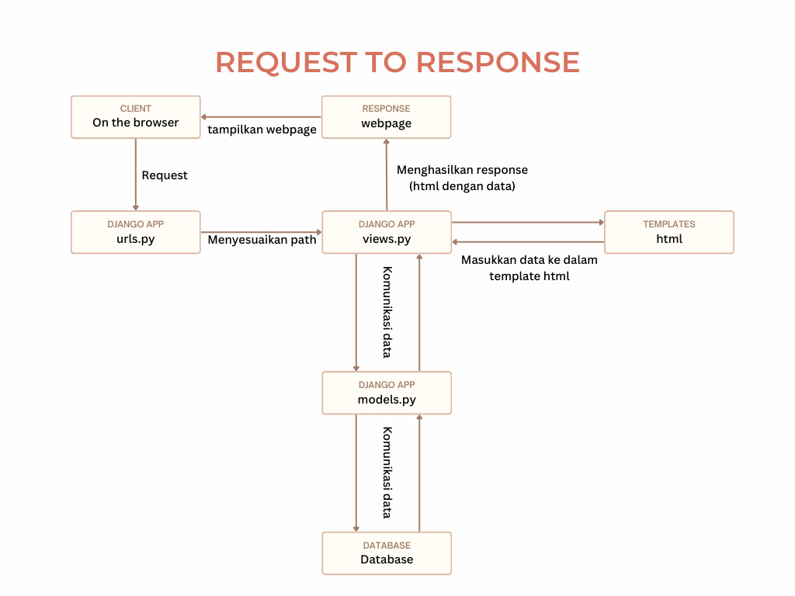
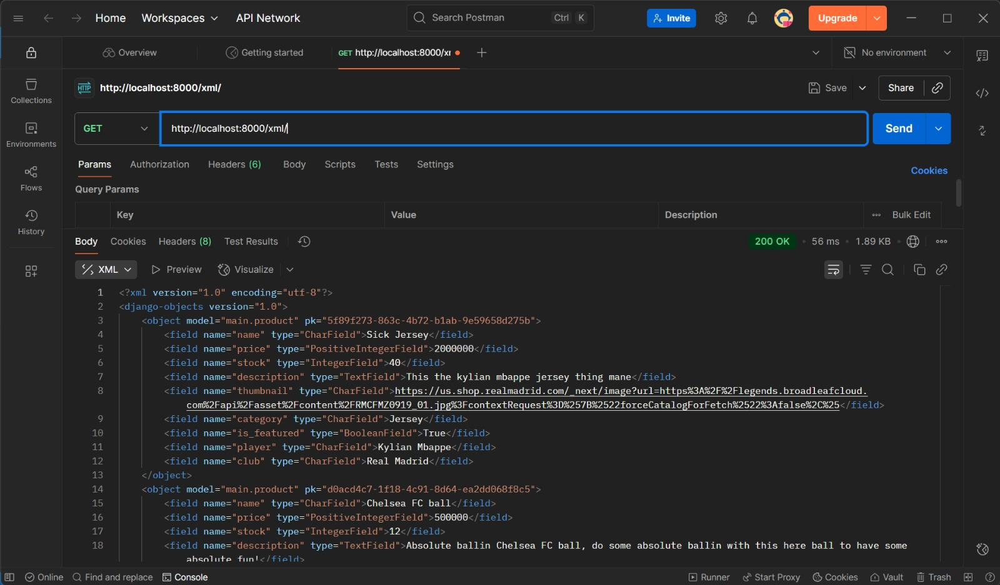
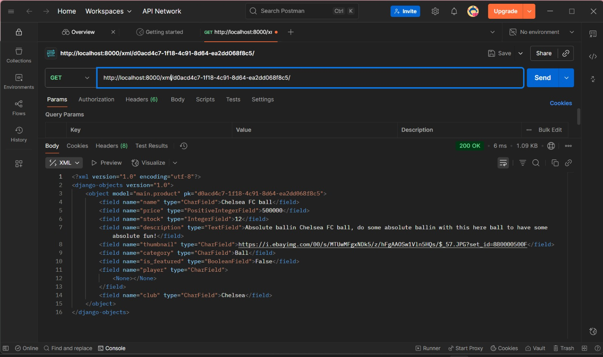
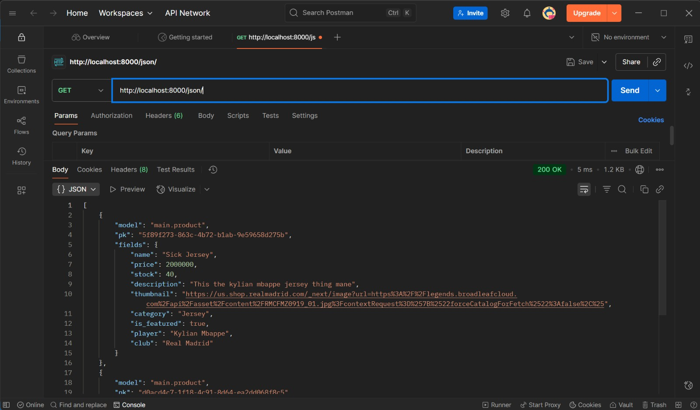
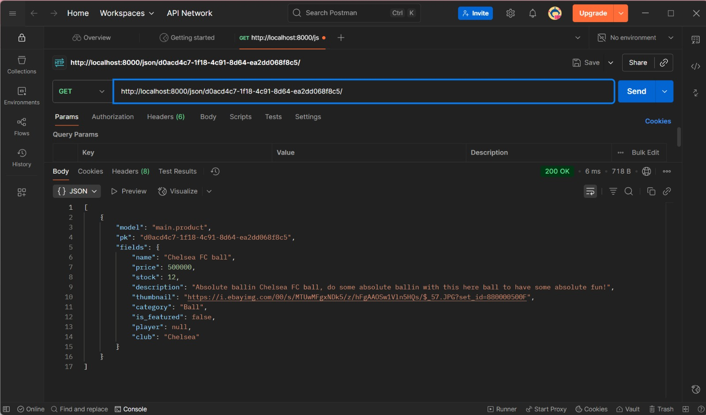

### Website: https://randuichi-touya-absoluteballin.pbp.cs.ui.ac.id/
### Repo: https://github.com/Sxccv/absolute-ballin/

# Tugas 2

## 1. Membuat sebuah proyek Django baru.
Pertama, buatlah folder baru untuk direktori utama, yaitu absolute-ballin. Selanjutnya, saya menginisialisasi venv python serta requirements yang saya butuhkan untuk proyek dengan ```requirements.txt```, setup ```.env``` dan ```.env.prod```. Langkah terakhir, saya menjalankan ```django-admin startproject absolute_ballin .``` untuk membuat project Django.

## 2. Membuat aplikasi dengan nama main pada proyek tersebut.
Jalankan command ```python manage.py startapp main``` dalam direktori utama dengan console

command ini akan membuat applikasi baru pada project ```absolute_ballin```

## 3. Melakukan routing pada proyek agar dapat menjalankan aplikasi main.
Tambahkan ```'main'``` pada ```INSTALLED_APPS``` pada ```settings.py``` dalam project folder

## 4. Membuat model pada aplikasi main dengan nama Product dan memiliki atribut wajib.
Buatlah class baru bernama Product dengan argumen ```models.Model``` pada ```models.py``` yang berisi atribut wajib seperti yang diminta pada berkas tugas

## 5.  Membuat sebuah fungsi pada views.py untuk dikembalikan ke dalam sebuah template HTML yang menampilkan nama aplikasi serta nama dan kelas kamu.
Membuat fungsi ```home(request)``` pada ```views.py``` yang berisi sebuah dictionary bernama ```data``` yang berisi data nama dan kelas saya. Lalu, fungsi tersebut akan return sebuah httpresponse menggunakan template ```home.html``` dan data pada dictionary ```data```

## 6. Membuat sebuah routing pada urls.py aplikasi main untuk memetakan fungsi yang telah dibuat pada views.py.
membuat pattern pada ```urls.py``` sebagai ```path('',views.home,name='main_home')``` yang berada pada aplikasi, dan juga menambahkan pattern ```path('', include('main.urls'))``` pada ```urls.py``` yang berada pada project Django

## 7. Melakukan deployment ke PWS terhadap aplikasi yang sudah dibuat sehingga nantinya dapat diakses oleh teman-temanmu melalui Internet.
melakukan command secara berurut, ```git add .```, ```git commit -m "Finished tugas 2"```, ```git push pws master```

## 8. Membuat sebuah README.md yang berisi tautan menuju aplikasi PWS yang sudah di-deploy, serta jawaban dari beberapa pertanyaan berikut.
ini sedang dibuat :D

## 9. Bagan yang berisi request client berserta respons

1. Client mengirim request ke aplilkasi django
2. Aplikasi akan menghandle request dan menyesuaikan path dengan ```urls.py```
3. ```urls.py``` akan menjalankan fungsi yang ada pada ```views.py``` 
4. ```views.py``` akan melakukan komunikasi dengan ```models.py``` yang melakukan komunikasi dengan database untuk retrieve dan store relevant data
5. ```views.py``` akan menyesuaikan data ke dalam template html pada direktori templates pada aplikasi sesuai dengan request
6. ```views.py``` akan menghasilkan ```httpresponse``` dan mengirimkannya kembali kepada client

## 10. Jelaskan ```settings.py```
```settings.py``` berperan sebagai penyimpanan seluruh atribut dan pengaturan penting bagi fungsi dan operasional aplikasi dan project Django. Segala informasi yang menunjuk kepada data yang dibutuhkan untuk menjalankan project terdapat disitu seperti daftar aplikasi, template, database, password, dll.

## 11. Jelaskan migrasi database di Django
Migrasi adalah proses untuk menerapkan perubahan pada models ke dalam schema database secara automatis. 

command ```makemigrations``` digunakan untuk membuat migrations baru berdasarkan perubahan pada models
command ```migrate``` digunakan untuk me-manage (applying and unapplying) migrations yang ada

## 12. Menurut Anda, dari semua framework yang ada, mengapa framework Django dijadikan permulaan pembelajaran pengembangan perangkat lunak?
Menurut saya, Django berguna sebagai titik introduksi pada yang belum sebelumnya mempelajari web development karena Django mostly menggunakan bahasa yang sudah kami gunakan pada DDP1, sehingga fokus pada pembelajaran dapat lebih tersudut kepada cara kerjanya web development. Selain itu, Django memiliki banyak "shortcut" yang mengakibatkan banyak automasi terjadi, dan menurut saya hal tersebut dapat disebut lebih "beginner friendly"

## 13. Apakah ada feedback untuk asisten dosen tutorial 1 yang telah kamu kerjakan sebelumnya?
tidak, terimakasih asdos semangat!

# Tugas 3

## 1.  Jelaskan mengapa kita memerlukan data delivery dalam pengimplementasian sebuah platform?
Karena data delivery adalah suatu process yang perlu agar dapat memberikan informasi dan data yang paling _up-to-date_ kepada client yang memakai platform kita. Dengan sistem data delivery yang baik, platform dapat mendukung berbagai fungsionalitas secara aman dengan waktu yang singkat untuk pengalaman user yang lancar.

## 2. Menurutmu, mana yang lebih baik antara XML dan JSON? Mengapa JSON lebih populer dibandingkan XML?
Menurut saya, tergantung. Json lebih populer dibandingkan XML untuk berbagai alasan. XML dan JSON memiliki format yang berbeda, dengan JSON memiliki format yang lebih mudah dibaca manusia maupun mesin, lebih fleksibel, dan lebih mudah digunakan dengan berbagai support API. Walaupun begitu, XML memiliki beberapa fitur yang tidak dimiliki JSON, seperti namespaces yang memungkinkan pembacaan XML tergantung URI, dan schema dimana dapat mengatur format untuk dokumen XML dan pihak lain dapat memverifikasi apakah XML yang dikirim cocok dengan format yang sudah diatur.

## 3. Jelaskan fungsi dari method is_valid() pada form Django dan mengapa kita membutuhkan method tersebut?
Method ```is_valid()``` berguna untuk melakukan validasi data pada form yang disubmit oleh klien dan dikaitkan dengan model atau vocabulary dari developler. Fungsi dari method tersebut adalah untuk memastikan bahwa data yang akan dimasukkan atau digunakan dari form sesuai dengan format yang sudah ditentukan pada database oleh developer agar tidak menimbulkan error pada database ataupun bug pada platform. 

## 4. Mengapa kita membutuhkan csrf_token saat membuat form di Django? Apa yang dapat terjadi jika kita tidak menambahkan csrf_token pada form Django? Bagaimana hal tersebut dapat dimanfaatkan oleh penyerang?
CSRF atau _Cross Site Request Forgeries_ adalah sebuah serangan siber yaitu ketika ada pihak yang melakukan request pada aplikasi web. Serangan tersebut dapat berakibatkan bocornya data dari database, maupun kerugian pada end-user. Serangan dapat berupa Http methods seperti POST, GET, PUT, Script, atau yang lain, tergantung vektor serangan.

## 5. Jelaskan bagaimana cara kamu mengimplementasikan checklist di atas secara step-by-step (bukan hanya sekadar mengikuti tutorial).

### a. Tambahkan 4 fungsi views baru untuk melihat objek yang sudah ditambahkan dalam format XML, JSON, XML by ID, dan JSON by ID.
Tambahkan fungsi ```show_xml```, ```show_xml_by_id```,```show_json```,```show_json_by_id``` yang mengembalikan HttpResponse yang diberi oleh server dengan sudah dilakukan serialization ke format XML/JSON.

### b. Membuat routing URL untuk masing-masing views yang telah ditambahkan pada poin a.
Menambahkan path untuk masing-masing views yang telah ditambahkan pada list ```urlpatterns``` pada ```urls.py```

### c. Membuat halaman yang menampilkan data objek model yang memiliki tombol "Add" yang akan redirect ke halaman form, serta tombol "Detail" pada setiap data objek model yang akan menampilkan halaman detail objek. 
Melakukan edit pada ```home.html``` untuk menambahkan ```button``` untuk melakukan redirect ke halaman ```add_product``` dan ke ```view_product``` yang dispesifikasikan di urls.py

### d. Membuat halaman form untuk menambahkan objek model pada app sebelumnya.
Buat ```add_product.html```, sambungkan pada ```views.py``` dan form pada ```forms.py```

### e. Membuat halaman yang menampilkan detail dari setiap data objek model.
Buat ```view_product.html```, sambungkan pada ```views.py``` dan data tergantung id

## 6. Apakah ada feedback untuk asdos di tutorial 2 yang sudah kalian kerjakan?
tidak

## Postman screenshots





# Tugas 4

## Apa itu Django AuthenticationForm? Jelaskan juga kelebihan dan kekurangannya
Django AuthenticationForm adalah class yang sederhana dari Django yang memberikan form sudah jadi, yang berisikan password dan username yang akan melakukan _authentication_ yaitu mengecek apakah usernam dan password benar dengan yang terdaftar, dan apakah user tersebut valid atau 'aktif'. Kelebihan dari AuthenticationForm adalah dapat dengan mudah menginmplementasi fitur seperti login dalam project, akan tetapi kekuranganya ada pada seberapa sederhana AuthenticationForm yang berarti jika ingin menggunakan fitur lebih lengkap harus tetap melakukan kustomisasi sendiri.

## Apa perbedaan antara autentikasi dan otorisasi? Bagaiamana Django mengimplementasikan kedua konsep tersebut?
Authentikasi adalah proses untuk menverifikasi siapa itu user seperti dengan fitur login dimana akan memverifikasi apakah ada user dengan username dan password tersebut, serta apakah user valid untuk melakukan login. Otorisasi adlaha proses memverifikasi akses-akses dan permission user tersebut. Authentication dilakukan dngan form seperti Django Authenticaton Form, Otorisasi dilakukan dengan decorator pada views, atau backend dengan model.

## Apa saja kelebihan dan kekurangan session dan cookies dalam konteks menyimpan state di aplikasi web?
Sessions merupakan cara yang lebih aman dan dapat menampung data yang lebih besar dibanding cookies akibat session di store di server. Ini juga berarti dibanding cookies, sessions lebih berat pada sisi server yang harus memanage session. Cookies berupa persistent yang berarti dapat menetap walaupun browser ditutup, lebih ringan, dan tidak memakai banyak sumber daya server. Akan tetapi, kendali cookies ada pada user, yang berarti dapat menjadi tidak reliable, serta keamanan yang kurang.

## Apakah penggunaan cookies aman secara default dalam pengembangan web, atau apakah ada risiko potensial yang harus diwaspadai? Bagaimana Django menangani hal tersebut?
Tidak aman. Cookies dapat susceptible terhadap penyerangan seperti cookie theft untuk hijack session atau authentication, manipulasi oleh klien, XSS atau cross-site scripting, dan CSRF. Ini di handle oleh Django dengan session data yang di store pada server, sessionid dan CSRF token yang random, mamakai teknologi signed dan enkripsi cookies untuk verifikasi lebih lanjut.

## Jelaskan bagaimana cara kamu mengimplementasikan checklist di atas secara step-by-step (bukan hanya sekadar mengikuti tutorial).

### 1. Mengimplementasikan fungsi registrasi, login, dan logout untuk memungkinkan pengguna mengakses aplikasi sebelumnya sesuai dengan status login/logoutnya.
Membuat fungsi login dan logout yang akan di authenticate dengan Django AuthenticationForm. Selanjutnya, memakai decorator untuk mewajibkan adanya login sebelum melakukan aktifitas pada website.

### 2. Membuat dua (2) akun pengguna dengan masing-masing tiga (3) dummy data menggunakan model yang telah dibuat sebelumnya untuk setiap akun di lokal.
Menggunakan fungsi register untuk membuat 2 akun baru, serta add product untuk menambahkan 3 product yang berhubungan dengan user-user tersebut.

### 3. Menghubungkan model Product dengan User.
Dengan mengimport ```User``` dari ```django.contrib.auth.models``` untuk dimasukkan kepada datafield user pada Product model dengan tipe data ```ForeignKey``` untuk menghubungkan kedua database tersebut.

### 4. Menampilkan detail informasi pengguna yang sedang logged in seperti username dan menerapkan cookies seperti last_login pada halaman utama aplikasi.
[akun1](akun1.jpeg)
[akun2](akun2.jpeg)
