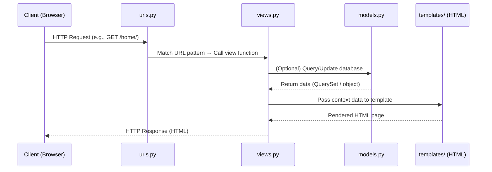

### Website: https://randuichi-touya-absoluteballin.pbp.cs.ui.ac.id/
### Repo: https://github.com/Sxccv/absolute-ballin/

# Checklist

## 1. 

```mermaid
sequenceDiagram
    participant C as Client (Browser)
    participant U as urls.py
    participant V as views.py
    participant M as models.py
    participant T as templates/ (HTML)

    C->>U: HTTP Request (e.g., GET /home/)
    U->>V: Match URL pattern → Call view function
    V->>M: (Optional) Query/Update database
    M-->>V: Return data (QuerySet / object)
    V->>T: Pass context data to template
    T-->>V: Rendered HTML page
    V-->>C: HTTP Response (HTML)
```